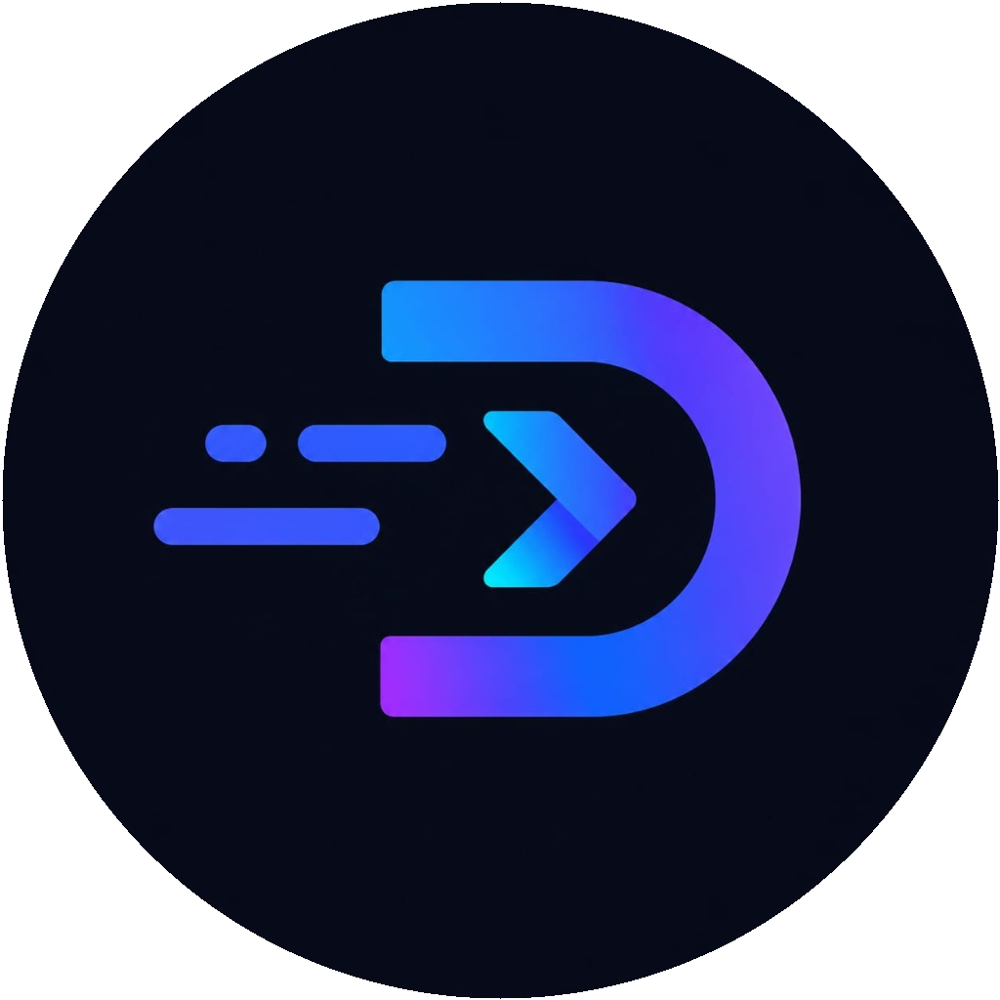
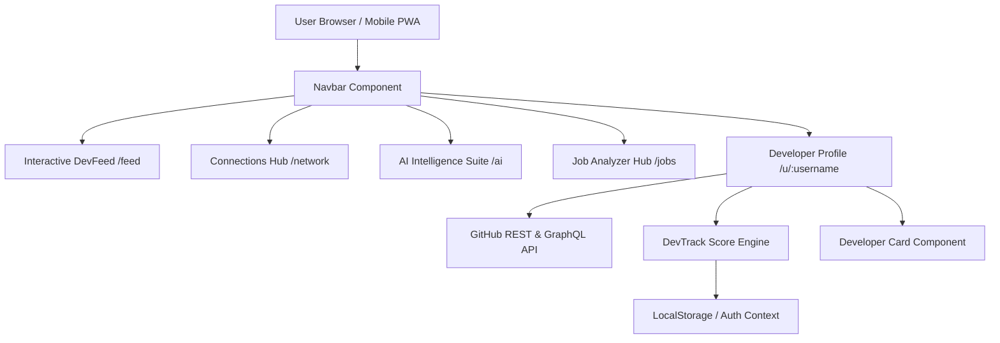

# DevTrack — The Professional Developer Identity Platform

<p align="center">
  
</p>

<p align="center">
  <strong>Transform raw GitHub activity, commits, and pull requests into verified developer cards, real-time developer scores, and a professional social network.</strong>
</p>

<p align="center">
  <a href="#-key-features"><strong>Explore Features</strong></a> •
  <a href="#-installation--setup"><strong>Quickstart</strong></a> •
  <a href="#-tech-stack"><strong>Tech Stack</strong></a> •
  <a href="#-project-architecture"><strong>Architecture</strong></a> •
  <a href="#-mobile--pwa"><strong>Mobile Experience</strong></a>
</p>

<p align="center">
  
  
  
  
  
  
</p>

---

## 📋 Table of Contents

- [Overview](#-overview)
- [Vision & Purpose](#-vision--purpose)
- [Key Features](#-key-features)
- [Tech Stack](#-tech-stack)
- [Project Architecture](#-project-architecture)
- [Folder Structure](#-folder-structure)
- [Installation & Setup](#-installation--setup)
- [Environment Variables](#-environment-variables)
- [Main Modules](#-main-modules)
  - [Developer Identity & Card Generator](#1-developer-identity--card-generator)
  - [Interactive DevFeed](#2-interactive-devfeed)
  - [Connections Networking Hub (`/network`)](#3-connections-networking-hub-network)
  - [AI Intelligence Suite (`/ai`)](#4-ai-intelligence-suite-ai)
  - [Job Analyzer Hub (`/jobs`)](#5-job-analyzer-hub-jobs)
- [Mobile & PWA Experience](#-mobile--pwa-experience)
- [Dual-Theme System](#-dual-theme-system)
- [Performance & Security](#-performance--security)
- [Roadmap](#-roadmap)
- [Contributing](#-contributing)
- [License & Credits](#-license--credits)

---

## 🚀 Overview

**DevTrack** is an engineering platform that synthesizes a developer's software footprint into a verified digital identity. By parsing real-time GitHub commit velocity, pull request reviews, repo clean ratios, and open-source contributions, DevTrack computes a **Developer Score (0-1000)** and generates an interactive, tier-badged **Developer Card**.

DevTrack includes a mobile-first PWA experience, WebGL liquid metal shader interactions, a LinkedIn-inspired developer networking hub, and AI-driven resume and career trajectory analyzers.

---

## 🎯 Vision & Purpose

Traditional resumes fail to capture real engineering capability. Text resumes miss commit consistency, architectural clean ratios, open source maintenance, and code review rigor. 

**DevTrack solves this by:**
1. Verifying developer identity through GitHub data pipelines.
2. Computing objective, multi-factor Developer Scores (0–1000).
3. Providing a high-utility developer network to showcase projects, find co-founders, and match with high-pay tech roles.

---

## ✨ Key Features

- 🎴 **Developer Identity Cards**: Tier-badged (Emerald, Diamond, Gold, Silver) developer cards with verified stats.
- ⚡ **Real-Time Developer Score (0–1000)**: Multi-algorithmic scoring engine parsing commit frequency, repo stars, and code health.
- 💬 **Interactive DevFeed**: Social feed for launching projects, sharing repository updates, posting code snippets, and publishing technical articles.
- 👥 **Connections Hub (`/network`)**: LinkedIn-inspired developer networking hub with followers, suggested dev discovery, and mutual connection tracking.
- 🧠 **AI Intelligence Suite (`/ai`)**: AI Profile Audits, GitHub Code Analysis, Resume ATS Compatibility Review, and Project Recommendations.
- 💼 **Job Analyzer Hub (`/jobs`)**: ATS score match, skill gap deficit identification, personalized 30-day learning roadmaps, and curated tech job listings.
- 🌊 **WebGL Liquid Metal Shaders**: Interactive WebGL shader surfaces built with `@paper-design/shaders` for buttons and navigation items.
- 📱 **Native Mobile PWA Experience**: 5-tab mobile bottom bar featuring a center **MovingBorder** Floating Action Button (FAB) and sheet drawer.
- ☀️ **Dual-Theme Engine**: Seamless toggle between Dark Glassmorphism Mode and Pure White Theme (Notion / Raycast Light inspired).

---

## 🛠️ Tech Stack

### Core Framework & Logic
- **Framework**: [Next.js 16 (App Router)](https://nextjs.org/)
- **Runtime**: [React 19](https://react.dev/)
- **Language**: [TypeScript](https://www.typescriptlang.org/)

### Styling & Motion
- **Styling**: Vanilla Tailwind CSS + Glassmorphism utilities
- **Animations**: [Framer Motion 12](https://www.framer.com/motion/)
- **WebGL Shaders**: `@paper-design/shaders` (Liquid Metal Fragment Shaders)
- **SVG Motion**: MovingBorder path-length animation

### Backend & Integrations
- **Authentication**: Firebase Client SDK & LocalStorage state persistence
- **Data Integrations**: GitHub REST API v3 & GraphQL API v4
- **Charts & Metrics**: Recharts & Custom Heatmaps
- **Icons**: Lucide-React & GitHub Brand Vectors

---

## 📐 Project Architecture



---

## 📁 Folder Structure

```
dev-track/
├── public/                     # Static assets, logos, PWA manifest, favicons
├── src/
│   ├── app/                    # Next.js App Router Pages & Routes
│   │   ├── ai/                 # AI Intelligence Suite (/ai)
│   │   ├── feed/               # Main DevFeed (/feed)
│   │   ├── jobs/               # Job Analyzer Hub (/jobs)
│   │   ├── network/            # Connections Networking Hub (/network)
│   │   ├── projects/           # Projects Showcase (/projects)
│   │   ├── u/[username]/       # Dynamic Developer Profile (/u/:username)
│   │   ├── layout.tsx          # Root Layout & SEO Metadata
│   │   └── page.tsx            # Hero Landing Page & Card Generator
│   ├── components/
│   │   ├── auth/               # Auth Modals & Context Providers
│   │   ├── card/               # Developer Card & Battle Modal
│   │   ├── dashboard/          # Contribution Heatmaps & Score Gauges
│   │   ├── devfeed/            # Feed Cards & Mobile Post Composer
│   │   ├── layout/             # Navbar, MobileTopBar, MobileBottomNav, Footer
│   │   ├── profile/            # Mobile & Desktop Profile Views
│   │   └── ui/                 # LiquidMetalButton, LiquidMetalWrapper, MovingBorder, TierAvatar
│   ├── lib/                    # Helper utilities (cn, formatting, calculation)
│   ├── services/               # GitHub API, Score Engine & AI Scanners
│   └── types/                  # TypeScript interfaces & definitions
├── package.json
└── tailwind.config.js
```

---

## 📦 Installation & Setup

### Prerequisites
- **Node.js**: v18.0.0 or higher
- **npm**: v9.0.0 or higher

### Steps

1. **Clone the Repository**
   ```bash
   git clone https://github.com/arupdas0825/Dev-Track.git
   cd dev-track
   ```

2. **Install Dependencies**
   ```bash
   npm install
   ```

3. **Configure Environment Variables**
   Create a `.env.local` file in the root directory:
   ```env
   NEXT_PUBLIC_APP_URL=http://localhost:3000
   NEXT_PUBLIC_FIREBASE_API_KEY=your_firebase_api_key
   NEXT_PUBLIC_FIREBASE_AUTH_DOMAIN=your_project.firebaseapp.com
   NEXT_PUBLIC_FIREBASE_PROJECT_ID=your_project_id
   NEXT_PUBLIC_FIREBASE_STORAGE_BUCKET=your_bucket.appspot.com
   NEXT_PUBLIC_FIREBASE_MESSAGING_SENDER_ID=your_sender_id
   NEXT_PUBLIC_FIREBASE_APP_ID=your_app_id
   GITHUB_TOKEN=your_optional_github_pat_for_higher_rate_limits
   ```

4. **Run the Development Server**
   ```bash
   npm run dev
   ```

5. **Open Application**
   Navigate to [http://localhost:3000](http://localhost:3000) in your browser.

---

## 🧩 Main Modules

### 1. Developer Identity & Card Generator
Generates exportable Developer Cards showcasing:
- Developer Grade & Tier (Master, Diamond, Emerald, Gold, Silver)
- Calculated Developer Score (0–1000)
- Top Languages distribution
- Pinned repositories, total stars, total forks, and contribution heatmaps

### 2. Interactive DevFeed
A real-time developer timeline for:
- Publishing Project Launches with repository links
- Sharing Code Snippets & Technical Articles
- Liking, commenting, and bookmarking dev updates

### 3. Connections Networking Hub (`/network`)
- Follow and connect with developers across the platform.
- Filter by followers, following, and pending requests.
- Discover suggested developers based on score & primary tech stack.

### 4. AI Intelligence Suite (`/ai`)
- **Profile Review**: Automated architecture archetype evaluation.
- **GitHub Analysis**: Code hygiene, PR acceptance rate, and security audits.
- **Resume ATS Analyzer**: Paste resume text for real-time ATS match scoring and strength recommendations.

### 5. Job Analyzer Hub (`/jobs`)
- Calculates job match compatibility scores.
- Identifies skill gap deficits and generates 30-day learning roadmaps.
- Recommends high-pay tech roles aligned with verified developer skills.

---

## 📱 Mobile & PWA Experience

DevTrack is designed with a **mobile-first PWA architecture**:
- **Single Sticky Top Bar**: Contains logo, search trigger, notifications, messages, avatar, and menu toggle.
- **5-Tab Bottom Navigation**:
  1. 🏠 **Home** (`/feed`)
  2. 👥 **Connections** (`/network`)
  3. ➕ **Create** (Center FAB with **MovingBorder** animated shader)
  4. 🧠 **AI Insights** (`/ai`)
  5. 💼 **Job Analyzer** (`/jobs`)
- **Creation Sheet**: Clicking the center FAB slides up a bottom drawer to create posts, launch projects, publish snippets, or share articles.

---

## ☀️ Dual-Theme System

DevTrack features two official theme modes:
- **🌙 Dark Theme**: Glassmorphism with deep slate backdrops, neon cyan/purple accents.
- **☀️ Pure White Theme**: Crisp white layout inspired by Notion, Raycast Light, and Linear.

Theme preferences persist automatically across sessions via `localStorage` and `ThemeContext`.

---

## 🔒 Performance & Security

- **Turbopack Build Optimization**: Lightning-fast compilation and HMR with Next.js 16 Turbopack.
- **Zero Input Mutation**: All user inputs are strictly validated before rendering.
- **Rate Limit Safety**: Fallback strategies and token handling for GitHub REST/GraphQL API rate limits.
- **Safe-Area Inset Support**: Full compatibility with modern mobile viewports and notch displays.

---

## 🗺️ Roadmap

- [x] WebGL Liquid Metal Shader buttons & wrappers
- [x] MovingBorder center FAB mobile bottom nav
- [x] Connections Networking Hub (`/network`)
- [x] AI Intelligence Suite & Resume ATS Analyzer (`/ai`)
- [x] Job Analyzer & Skill Gap Roadmap (`/jobs`)
- [x] Pure White Theme integration
- [ ] Server-Verified Auth via Firebase Admin SDK
- [ ] Supabase PostgreSQL database migration
- [ ] Webhook signature verification for Developer Cards
- [ ] WhatsApp & Discord Webhook Developer Notifications

---

## 🤝 Contributing

Contributions are welcome! Please follow these steps:

1. Fork the project repository.
2. Create your feature branch (`git checkout -b feature/amazing-feature`).
3. Commit your changes (`git commit -m 'feat: add amazing feature'`).
4. Push to the branch (`git push origin feature/amazing-feature`).
5. Open a Pull Request.

---

## 📄 License & Credits

Distributed under the **MIT License**. See `LICENSE` for details.

Developed with ❤️ for the global developer community by **[DevTrack Team](https://github.com/arupdas0825/Dev-Track)**.
