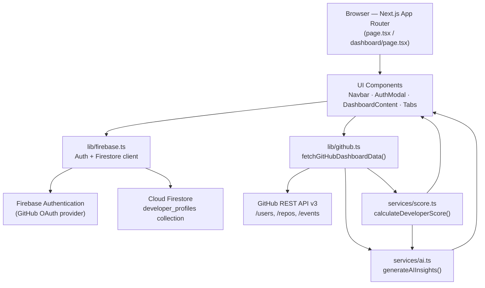
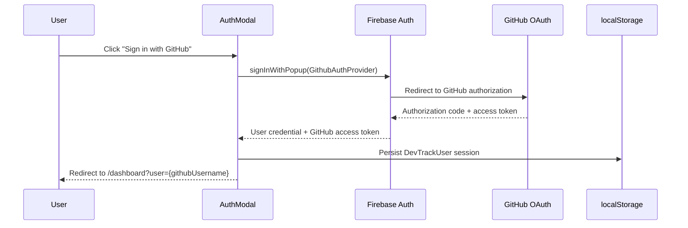
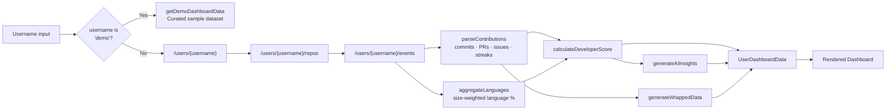

<div align="center">


 

#  DevTrack

### AI-Powered Developer Intelligence Platform

**Track. Analyze. Elevate.**

DevTrack turns raw GitHub activity into a measurable Developer Score, AI-generated career insights, and a shareable annual "GitHub Wrapped" report — wrapped in a GitHub × Linear × Vercel–inspired interface.

[](https://nextjs.org/)
[](https://react.dev/)
[](https://www.typescriptlang.org/)
[](https://tailwindcss.com/)
[](https://firebase.google.com/)
[](https://vercel.com/)
[](#-license)
[](#-contributing)

[](https://dev-track-brown.vercel.app/)

[Overview](#-project-overview) · [Features](#-key-features) · [Architecture](#-architecture-overview) · [Installation](#-installation-guide) · [Roadmap](#-future-roadmap) · [Contributing](#-contributing)

</div>

---

## 📌 Project Overview

**DevTrack** is a web platform that connects to a developer's GitHub profile and converts their public activity — repositories, commits, languages, stars, forks, pull requests — into structured, actionable intelligence.

Instead of just listing repositories like a typical GitHub stats widget, DevTrack computes a quantitative **Developer Score**, runs that score through a **rules-based AI insight engine** to surface strengths, weaknesses, and a personalized learning roadmap, and packages a year of activity into a **GitHub Wrapped**–style summary.

The product is built to support three audiences at once:

| Audience | What DevTrack gives them |
|---|---|
| **Developers** | An objective, explainable score and a roadmap for what to improve next |
| **Recruiters / Reviewers** | A fast, visual read on a candidate's technical breadth and consistency |
| **Researchers / Admissions reviewers** | Quantified evidence of growth, diversity, and open-source contribution for academic portfolios |

A live demo mode (`?user=demo`) is built in, so anyone can explore the full dashboard — Developer Score, AI Insights, and Wrapped — without connecting a GitHub account or configuring Firebase.

### 🌐 Live Demo

**[https://dev-track-brown.vercel.app/](https://dev-track-brown.vercel.app/)**

Click **"Try Demo"** on the landing page (or visit `/dashboard?user=demo` directly) to explore the full dashboard instantly — no sign-in required.

---

## 🎯 Vision & Mission

> **Vision:** Become the developer-facing equivalent of a credit score — a single, explainable number and narrative that represents technical growth, consistency, and open-source impact.

**Mission:**

- Turn passive GitHub activity into **active self-awareness** for developers.
- Replace vanity metrics (raw star counts) with a **multi-factor, explainable score**.
- Give every developer a **personalized roadmap**, not just a dashboard.
- Provide a **research-grade analytics layer** that's credible enough to support graduate-school and job applications.

DevTrack is intentionally positioned as a **Developer Intelligence Platform**, not "another GitHub stats card."

---

## ✨ Key Features

| Feature | Description | Status |
|---|---|---|
| 🔐 **GitHub OAuth via Firebase** | One-click sign-in using Firebase's `GithubAuthProvider`, with `read:user` and `repo` scopes | ✅ Implemented |
| 🧪 **Zero-config Demo Mode** | Full dashboard experience with curated sample data — no GitHub token or Firebase setup required | ✅ Implemented |
| 📊 **Live GitHub Analytics** | Profile, repository, language, and event data pulled directly from the GitHub REST API | ✅ Implemented |
| 🧮 **Developer Score Engine** | Deterministic 0–100 score across 5 weighted categories, each with a human-readable justification | ✅ Implemented |
| 🤖 **AI Insights Engine** | Rules-based engine that derives strengths, weaknesses, recommendations, a suggested stack, a career direction, and a staged learning roadmap from the score | ✅ Implemented |
| 🎁 **GitHub Wrapped** | Annual-recap style summary — top language, longest streak, biggest achievement, contributor percentile | ✅ Implemented |
| ☁️ **Firestore Persistence** | Developer snapshots persisted per-username, with automatic `localStorage` fallback when Firebase isn't configured | ✅ Implemented |
| 🗂️ **Modular Dashboard** | Tabbed architecture — Overview, Repositories, Contributions, Languages, Score, AI Insights, Wrapped, Settings | ✅ Implemented |
| 🎨 **GitHub-inspired UI** | Dark, data-dense interface built with Tailwind CSS 4 and Framer Motion micro-interactions | 🚧 In Progress |
| 📈 **Contribution Heatmap & Advanced Charts** | Recharts-powered visualizations across all analytics tabs | 🚧 In Progress |
| 🧠 **Generative AI Narratives** | Upgrading the rules engine to an LLM-backed insight generator | 🗺️ Planned |

---

## 🖼️ Screenshots

> Screenshots will be added as the UI redesign (Phase 2) lands. Drop your own captures into `docs/screenshots/` and update the paths below.

| Landing Page | Dashboard — Overview | Developer Score |
|---|---|---|
| 
| 
 |  |

| AI Insights | GitHub Wrapped | Repositories |
|---|---|---|
|  |  |  |

---

## 🏗️ Architecture Overview

DevTrack follows a layered architecture: a Next.js App Router frontend calls a thin service layer, which calls external providers (GitHub REST API, Firebase) and feeds the result through two in-house intelligence services before rendering.



**Design principles:**

- **Service isolation** — `lib/github.ts` knows nothing about React; `services/score.ts` and `services/ai.ts` are pure functions that take typed data in and return typed data out.
- **Graceful degradation** — every external dependency (Firebase, GitHub token, live event data) has a deterministic fallback so the app never shows a broken state.
- **Typed contracts** — every cross-layer object (`GitHubProfile`, `DeveloperScore`, `AIInsights`, `UserDashboardData`, …) is defined once in `src/types/index.ts` and shared across the entire stack.

---

## 🛠️ Tech Stack

### Frontend

| Technology | Version | Purpose |
|---|---|---|
| [Next.js](https://nextjs.org/) | `16.2.9` | App Router, routing, SSR/CSR hybrid rendering |
| [React](https://react.dev/) | `19.2.4` | UI rendering |
| [TypeScript](https://www.typescriptlang.org/) | `^5` | Static typing across the entire codebase |
| [Tailwind CSS](https://tailwindcss.com/) | `^4` | Utility-first styling, custom design tokens via `@theme` |
| [Framer Motion](https://www.framer.com/motion/) | `^12` | Page and component-level animation |
| [Recharts](https://recharts.org/) | `^3.8` | Charts for contributions, languages, and score breakdowns |
| [Lucide React](https://lucide.dev/) | `^1.21` | Icon system |
| `clsx` / `tailwind-merge` | latest | Conditional and conflict-free class composition |

### Backend & Platform Services

| Technology | Purpose |
|---|---|
| [Firebase Authentication](https://firebase.google.com/products/auth) | GitHub OAuth sign-in and session management |
| [Cloud Firestore](https://firebase.google.com/products/firestore) | Persisted developer profile snapshots |
| [Firebase Analytics](https://firebase.google.com/products/analytics) | Client-side usage analytics (auto-disabled if unsupported) |
| [GitHub REST API v3](https://docs.github.com/en/rest) | Source of truth for profile, repository, and event data |
| [Vercel](https://vercel.com/) | Hosting and CI/CD target |

---

## 📁 Project Structure

```
src/
├── app/
│   ├── page.tsx                  # Landing page (hero, search, demo CTA)
│   ├── layout.tsx                # Root layout, fonts, metadata
│   └── dashboard/
│       └── page.tsx              # Dashboard route (Suspense-wrapped)
│
├── components/
│   ├── auth/
│   │   └── AuthModal.tsx         # GitHub OAuth modal (Firebase popup flow)
│   ├── ui/
│   │   └── Logo.tsx              # Brand mark
│   ├── layout/
│   │   ├── Navbar.tsx            # Global navigation + auth controls
│   │   └── Footer.tsx
│   └── dashboard/
│       ├── DashboardContent.tsx  # Tab router + data orchestration
│       ├── OverviewTab.tsx
│       ├── RepositoriesTab.tsx
│       ├── ContributionsTab.tsx
│       ├── LanguagesTab.tsx
│       ├── ScoreTab.tsx
│       ├── AIInsightsTab.tsx
│       ├── WrappedTab.tsx
│       └── SettingsTab.tsx
│
├── lib/
│   ├── firebase.ts                # Auth, Firestore, DevTrackUser model
│   ├── github.ts                  # GitHub API client + data aggregation
│   └── utils.ts                   # Shared helpers
│
├── services/
│   ├── score.ts                   # Developer Score algorithm
│   └── ai.ts                      # AI Insights rules engine
│
└── types/
    └── index.ts                   # Shared TypeScript contracts
```

---

## 🔐 Authentication Flow

DevTrack uses **Firebase Authentication** with the **GitHub provider**, with a built-in mock mode so the app is fully functional before any credentials are configured.



**Key behaviors:**

- OAuth scopes requested: `read:user`, `repo`
- On every sign-in, the returned **GitHub access token** is attached to the session so subsequent API calls aren't subject to the unauthenticated GitHub rate limit (60 req/hr).
- `subscribeToAuthChanges()` listens for Firebase auth state changes and rehydrates the session on page reload.
- **If Firebase environment variables are absent**, the app automatically falls back to a **mock authentication mode** — a demo user (`devtrack-demo`) is created in `localStorage` so the product remains demoable in any environment, including local development without secrets.

**Production hardening still needed (see [Roadmap](#-future-roadmap)):** structured error handling for popup-blocked/cancelled flows, first-time-user onboarding, and refresh-token handling for expired GitHub tokens.

---

## 🔗 GitHub Integration Flow

All analytics are derived from a single orchestration function, `fetchGitHubDashboardData(username, token)`, in `src/lib/github.ts`:



**Notable engineering decisions:**

- **Event-based streak calculation** — `parseContributions` walks the last 100 GitHub events to compute daily activity, longest streak, and current streak.
- **Heuristic fallback for sparse data** — because the GitHub Events API only returns recent activity, commit/PR/issue totals are floored with a conservative estimate derived from `public_repos`, `stargazers_count`, and `forks_count`, so scores never bottom out purely due to API pagination limits.
- **Size-weighted language stats** — `aggregateLanguages` approximates language share using each repository's `size` (KB) as a proxy, sorted by weight descending.
- **Instant demo path** — `username === "demo"` or `"devtrack-demo"` short-circuits straight to a hand-curated dataset, bypassing the GitHub API entirely.

---

## 🧮 Developer Score System

The **Developer Score** is a deterministic, fully explainable 0–100 metric computed in `services/score.ts`. It is the core differentiator of the product — every sub-score ships with a plain-English justification string.

```
Developer Score (0–100)
   =  Consistency      (0–20)
   +  Repository Quality (0–20)
   +  Technical Diversity (0–20)
   +  Open Source Impact (0–20)
   +  Project Complexity (0–20)
```

| Category | Max | Formula (simplified) | Signal |
|---|---|---|---|
| **Consistency** | 20 | `min(10, totalCommits/200 × 10)` + `min(10, longestStreak/21 × 10)` | Commit volume + streak length |
| **Repository Quality** | 20 | `min(10, log₂(avgStars+1) × 3)` + `(reposWithDescription / totalRepos) × 10` | Community validation + documentation discipline |
| **Technical Diversity** | 20 | `min(10, uniqueLanguages/5 × 10)` + entropy-based balance score | Breadth + how evenly spread across stacks |
| **Open Source Impact** | 20 | `min(10, log₂(totalForks+1) × 3.3)` + `min(10, (PRs+Issues)/25 × 10)` | External reuse + collaboration activity |
| **Project Complexity** | 20 | `min(10, avgRepoSizeKB/50000 × 10)` + `(originalRepos / totalRepos) × 10` | Codebase substance + originality vs. forks |

Each category returns a `*Reason` string (e.g. *"High commit regularity and solid continuous contribution streak"*) so the score is never a black box — this is the foundation the AI Insights Engine builds on top of.

---

## 🤖 AI Intelligence Engine

The **AI Insights Engine** (`services/ai.ts`) is a **deterministic rules engine**, not a third-party LLM call — it converts the five Developer Score categories into structured, narrative guidance with zero network latency and zero token cost.

**Current outputs:**

| Output | How it's derived |
|---|---|
| **Strengths** | Triggered when a category clears a high threshold (e.g. `diversity ≥ 15` → "Polyglot profile with capability in multiple ecosystems") |
| **Weaknesses** | Triggered when a category falls below a low threshold, with safe fallbacks so the list is never empty or hostile |
| **Recommendations** | Category-specific action items (e.g. low `repoQuality` → "Write rich README files for your top 3 pinned repos") |
| **Suggested Technologies** | Mapped from the developer's dominant language (TypeScript → Next.js/GraphQL/Prisma; Python → FastAPI/PyTorch/LangChain; Go → gRPC/Kafka/Kubernetes; Rust → Tokio/WASM/Tauri) |
| **Career Direction** | Combines top language + overall score band (e.g. TypeScript + score > 75 → *"Senior Full-Stack Web Engineer / Architect"*) |
| **Learning Roadmap** | A fixed 3-stage plan — *Foundational Strengthening → Architecture & Integration → DevOps & Open Source Scaling* — populated with the developer's own suggested stack |

**Why rules-based first?** It guarantees the engine is fast, free to run, fully reproducible, and safe to ship without prompt-injection or hallucination risk — while still satisfying the product's "AI-powered" positioning honestly.

**Planned upgrade (Phase 5):** swap the static thresholds for an LLM-backed generation layer (e.g. via the Anthropic API) that takes the same `DeveloperScore` + GitHub dataset as structured input and produces richer, more personalized natural-language narratives, interview-prep suggestions, and project ideas — without changing the existing type contracts.

---

## ⚙️ Installation Guide

### Prerequisites

- **Node.js** ≥ 18.18
- **npm**, **yarn**, **pnpm**, or **bun**
- A **GitHub account** (for OAuth setup — optional, demo mode works without it)
- A **Firebase project** (optional — only required for real authentication and persistence)

### Steps

```bash
# 1. Clone the repository
git clone https://github.com/arupdas0825/Dev-Track.git
cd Dev-Track

# 2. Install dependencies
npm install

# 3. Configure environment variables (optional — see below)
cp .env.example .env.local   # create this file if it doesn't exist yet

# 4. Run the development server
npm run dev
```

Open [http://localhost:3000](http://localhost:3000). If no Firebase credentials are configured, DevTrack automatically runs in **mock auth mode** — click **"Try Demo"** or sign in to explore the full dashboard with sample data.

---

## 🔑 Environment Variables

All variables are **optional** — DevTrack falls back to demo/mock mode when they're missing. They are required only for real Firebase-backed GitHub OAuth and Firestore persistence.

| Variable | Required for | Where to find it |
|---|---|---|
| `NEXT_PUBLIC_FIREBASE_API_KEY` | Auth + Firestore | Firebase Console → Project Settings → General |
| `NEXT_PUBLIC_FIREBASE_AUTH_DOMAIN` | Auth | Firebase Console → Project Settings → General |
| `NEXT_PUBLIC_FIREBASE_PROJECT_ID` | Auth + Firestore | Firebase Console → Project Settings → General |
| `NEXT_PUBLIC_FIREBASE_STORAGE_BUCKET` | Firestore | Firebase Console → Project Settings → General |
| `NEXT_PUBLIC_FIREBASE_MESSAGING_SENDER_ID` | Auth | Firebase Console → Project Settings → General |
| `NEXT_PUBLIC_FIREBASE_APP_ID` | Auth + Firestore | Firebase Console → Project Settings → General |
| `NEXT_PUBLIC_FIREBASE_MEASUREMENT_ID` | Analytics | Firebase Console → Project Settings → General |

Example `.env.local`:

```env
NEXT_PUBLIC_FIREBASE_API_KEY=your_api_key
NEXT_PUBLIC_FIREBASE_AUTH_DOMAIN=your_project.firebaseapp.com
NEXT_PUBLIC_FIREBASE_PROJECT_ID=your_project_id
NEXT_PUBLIC_FIREBASE_STORAGE_BUCKET=your_project.appspot.com
NEXT_PUBLIC_FIREBASE_MESSAGING_SENDER_ID=000000000000
NEXT_PUBLIC_FIREBASE_APP_ID=1:000000000000:web:xxxxxxxxxxxxx
NEXT_PUBLIC_FIREBASE_MEASUREMENT_ID=G-XXXXXXXXXX
```

> ⚠️ Never commit `.env.local` — it is already covered by `.gitignore`.

---

## 🔥 Firebase Setup

1. Go to the [Firebase Console](https://console.firebase.google.com/) and create a new project.
2. Navigate to **Build → Authentication → Sign-in method** and enable the **GitHub** provider.
3. Navigate to **Build → Firestore Database** and create a database (start in test mode for local development, then lock down rules before production).
4. Go to **Project Settings → General → Your apps**, register a **Web app**, and copy the config values into `.env.local` as shown above.
5. Under **Authentication → Settings**, copy the **authorized redirect URI** — you'll need it for the GitHub OAuth App in the next step.

---

## 🐙 GitHub OAuth Setup

1. Go to **GitHub → Settings → Developer settings → OAuth Apps → New OAuth App**.
2. Fill in:
   - **Application name:** `DevTrack`
   - **Homepage URL:** `https://dev-track-brown.vercel.app/`
   - **Authorization callback URL:** `https://<your-firebase-project-id>.firebaseapp.com/__/auth/handler`
3. Click **Register application**, then generate a **Client Secret**.
4. Copy the **Client ID** and **Client Secret** into the GitHub provider configuration in **Firebase Console → Authentication → Sign-in method → GitHub**.
5. Save — GitHub sign-in via `signInWithPopup` will now issue real access tokens through Firebase.

---

## 💻 Running Locally

```bash
npm run dev
```

Visit [http://localhost:3000](http://localhost:3000). The dev server supports Fast Refresh — most component edits apply instantly.

---

## 📦 Building for Production

```bash
npm run build
npm run start
```

`npm run build` produces an optimized production build; `npm run start` serves it. Run `npm run lint` before committing to catch ESLint issues early.

---

## 🚀 Deployment on Vercel

1. Push your fork/clone to GitHub.
2. Go to [vercel.com/new](https://vercel.com/new) and import the repository.
3. Vercel auto-detects the Next.js framework — no build command overrides needed.
4. Add all variables from [Environment Variables](#-environment-variables) under **Project Settings → Environment Variables**.
5. Click **Deploy**.
6. Update your GitHub OAuth App's **Authorization callback URL** and Firebase **Authorized domains** to include your new Vercel domain.

---

## 🗺️ Future Roadmap

Current overall build estimate: **~40–45% of the full product vision**, with the analytics, scoring, and AI heuristics core already functional. Remaining work is tracked in phases:

| Phase | Focus | Priority |
|---|---|---|
| **1. Stabilization** | Harden Firestore sync, fix auth loading edge cases, remove remaining mock fallbacks in production paths, improve error boundaries | Critical |
| **2. Landing Page Rebuild** | GitHub-inspired color system, investor-ready SaaS landing page, product/dashboard preview sections | Critical |
| **3. Real GitHub Analytics Depth** | Expand profile/repo/contribution/language/community analytics beyond the current REST-API snapshot (issue velocity, PR review turnaround, org-level stats) | Highest |
| **4. Developer Score Engine v2** | Tune weighting, add time-decay so recent activity matters more, expose historical score trendlines | Highest |
| **5. AI Intelligence Engine v2** | Replace static thresholds with LLM-generated narratives, interview-prep suggestions, and dynamic project ideas | High |
| **6. GitHub Wrapped v2** | Shareable image/social-card export, richer "developer journey" storytelling | Medium |
| **7. Data Persistence** | Dedicated Firestore collections: `users`, `analytics_snapshots`, `developer_scores`, `ai_reports`, `wrapped_reports` for true historical tracking | High |
| **8. Premium Dashboard** | Contribution heatmap, advanced Recharts visualizations, growth analytics, developer timeline | Medium |
| **9. Research / Admissions Mode** | Research-style analytics export, predictive growth scoring, portfolio-quality analysis tailored for MSc/PhD application packets | Medium |

---

## 🤝 Contributing

Contributions, issues, and feature requests are welcome.

1. **Fork** the repository and create your branch:
   ```bash
   git checkout -b feature/your-feature-name
   ```
2. **Follow the existing conventions** — TypeScript strict mode, Tailwind utility classes over custom CSS, functional React components.
3. **Run lint and a local build** before opening a PR:
   ```bash
   npm run lint
   npm run build
   ```
4. **Commit using clear, conventional messages** (e.g. `feat: add streak-decay weighting to consistency score`).
5. **Open a Pull Request** describing the change, the motivation, and any screenshots for UI changes.

For larger changes (new dashboard tabs, scoring algorithm changes, new Firestore collections), please open an issue first to discuss the approach.

---

## 📄 License

This project is intended to be released under the **MIT License**.

> This repository does not yet include a `LICENSE` file — add one (e.g. via GitHub's *"Add file → Create new file → LICENSE"* template) before distributing or open-sourcing the project publicly to make this binding.

---

## 👤 Author

**Arup Das**
B.Tech, Computer Science & Engineering (AI/ML) · Brainware University

Building DevTrack as a portfolio-grade, research-flavored full-stack project — combining real-time GitHub analytics, an explainable scoring algorithm, and an AI insight layer aimed at demonstrating technical depth for graduate-school and engineering portfolios.

- GitHub: [@arupdas0825](https://github.com/arupdas0825)
- Project repository: [Dev-Track](https://github.com/arupdas0825/Dev-Track)

---

<div align="center">

If DevTrack is useful to you, consider giving it a ⭐ — it helps others discover the project.

</div>
